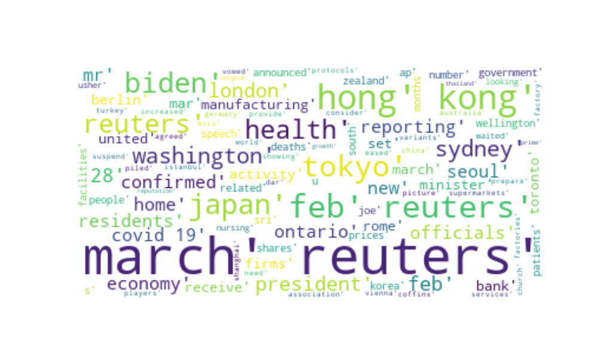

# News_API_Covid_Dataset

## Description

In this project, we create a dataset to use a function that applies the concept of POS tagging to identify keywords
News API is a big data source for search and retrieve live articles all over the Internet

## Wordcloud Dataset Output

## REF
https://www.programmableweb.com/news/how-to-extract-covid-19-keywords-news-using-python/how-to/2020/03/11
https://medium.com/analytics-vidhya/extracting-keywords-from-covid-19-news-with-python-13249571d37b
